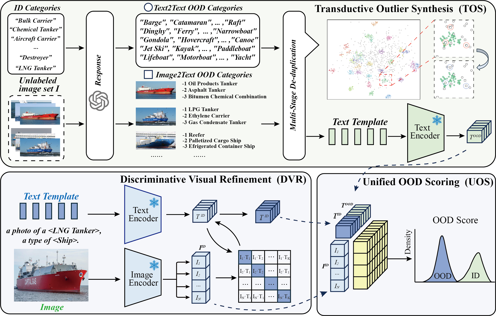
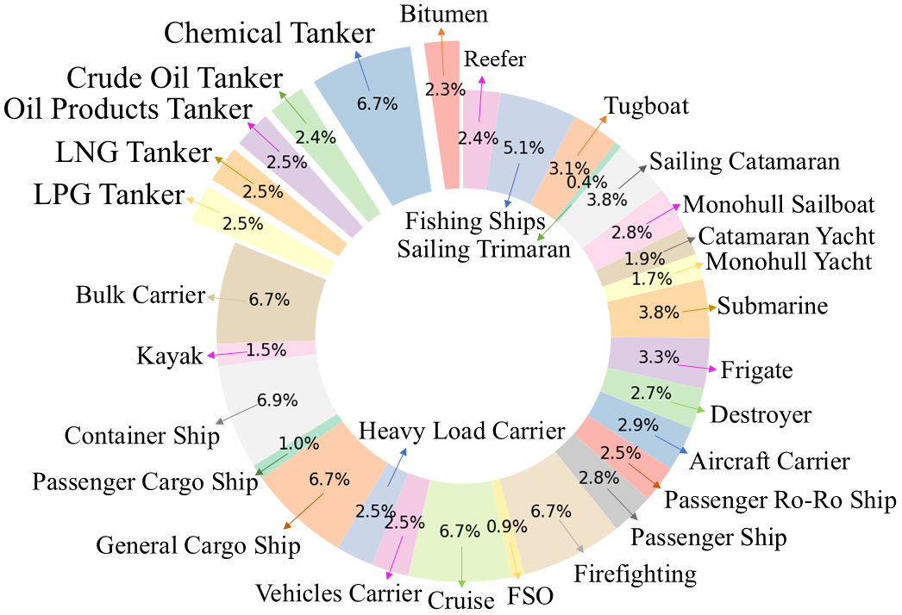
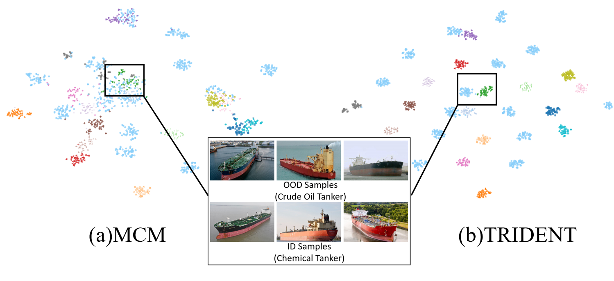

# Ship30: Benchmarking Fine-grained Out-of-distribution Ship Detection

[](https://www.python.org/downloads/)
[](https://pytorch.org/)

> **TL;DR:** We construct **Ship30**, the first fine-grained OOD ship detection benchmark with 30 categories and 8,964 annotated images. We also propose **TRIDENT** (Text-guided Refinement for ID and OOD ENTities), a novel framework that leverages LLMs to expand pseudo-OOD label space and enhances ID category discrimination via visual refinement, achieving average improvements of 10.42% in FPR95 and 5.37% in AUROC over state-of-the-art methods.

---

## 📋 Table of Contents

- [Overview](#overview)
- [Key Features](#key-features)
- [Installation](#installation)
- [Dataset Preparation](#dataset-preparation)
- [Quick Start](#quick-start)
  - [1. Train Discriminative Visual Refinement (DVR)](#1-train-discriminative-visual-refinement-dvr)
  - [2. Evaluate OOD Detection](#2-evaluate-ood-detection)
- [OOD Task Types](#ood-task-types)
  - [Fine-grained OOD](#fine-grained-ood)
  - [Far OOD](#far-ood)
- [Project Structure](#project-structure)
- [Results](#results)
- [Citation](#citation)
- [License](#license)

---

## 🔭 Overview

Out-of-Distribution (OOD) detection aims to identify inputs that do not belong to the training distribution. In maritime scenarios, the growing diversity of ship categories and the high visual similarity between different ship types make fine-grained OOD ship detection particularly challenging.

**TRIDENT** addresses this through three key modules:

1. **Transductive Outlier Synthesis (TOS):** Uses LLMs (GPT-4o, Gemini, Claude) to generate potential OOD category descriptions from ID labels or a few ID images, expanding the model's semantic scope with a multi-stage deduplication strategy.
2. **Discriminative Visual Refinement (DVR):** Trains a lightweight MLP (C_DVR) on top of frozen CLIP visual features to optimize text representations with image semantics, enhancing the model's ability to discriminate subtle visual differences between fine-grained ID categories.
3. **Unified OOD Scoring (UOS):** Integrates OOD textual representations from TOS with optimized ID textual representations from DVR, computing a fused similarity score that contrasts ID confidence against OOD candidate confidence.

<p align="center">
  
</p>

---

## ✨ Key Features

- **🚢 Ship30 Benchmark:** The first fine-grained OOD ship detection dataset with 30 categories, 8,964 annotated images, covering shooting distance effects, lighting variation, and scene diversity.
- **🤖 LLM-Driven OOD Label Expansion:** TOS generates pseudo-OOD category labels from ID labels or images via LLMs, with multi-stage deduplication.
- **🎯 Visual Refinement for Fine-grained Discrimination:** DVR optimizes text embeddings with image semantics via a lightweight MLP (~10K parameters), keeping CLIP encoders frozen.
- **⚡ Millisecond-Level Inference:** Average CLIP inference latency of only 2.71ms per image, reaching practical deployment level.
- **📊 Comprehensive Evaluation:** Supports fine-grained OOD (CUB-100, Cars-98, Pet-18, Food-50, Ship-14) and classic OOD (iNaturalist, SUN, Places, Texture) benchmarks.
- **🔧 Flexible Configuration:** Adjustable number of sampled images (I) and pseudo-OOD categories (L), with multiple scoring function ablations.

---

## 🛠 Installation

### Prerequisites

- Python >= 3.8
- PyTorch >= 2.0 with CUDA support
- NVIDIA GPU with sufficient VRAM (>= 12GB recommended for ViT-L/14)

### Step 1: Clone the Repository

```bash
git clone https://github.com/chenxiyou-1314/TRIDENT.git
cd TRIDENT
```

### Step 2: Install Dassl Framework

This project is built on top of [Dassl.pytorch](https://github.com/KaiyangZhou/Dassl.pytorch). Install it first:

```bash
pip install -e Dassl.pytorch/
```

### Step 3: Install Python Dependencies

```bash
pip install -r requirements.txt
```

### Step 4: Configure LLM API Key (Optional)

If you want to generate new OOD candidate classes with LLMs:

```bash
export OPENAI_API_KEY="sk-your-api-key"
# or for custom API endpoint:
export OPENAI_BASE_URL="https://your-endpoint.com/v1"
```

> **Note:** If you only use pre-generated JSON files (without `--generate_class`), no API key is required.

---

## 📁 Dataset Preparation

### Ship30 Dataset

The Ship30 dataset contains 30 fine-grained ship categories and 8,964 annotated images. Images are sourced from high-definition surveillance cameras and web sources (VesselFinder, MarineTraffic, Baidu Images), followed by rigorous cleaning and fine-grained annotation based on IMO standards.

<p align="center">
  
</p>

Organize your datasets under a root directory (e.g., `/data/datasets`):

```
/data/datasets/
├── Ship30/
│   ├── images/
│   └── split_zhou_Ship30.json
├── CUB-200-2011/
├── stanford_cars/
├── food-101/
├── oxford-pets/
└── imagenet/
```

Set the dataset root in training/evaluation commands using `--root`.

---

## 🚀 Quick Start

### 1. Train Discriminative Visual Refinement (DVR)

For **fine-grained OOD** tasks (e.g., Ship-14, CUB-100, Pet-18, Cars-98, Food-50), you need to train the DVR model first:

```bash
bash scripts/train.sh ship14_ID 16
```

This trains a DVR model with 16-shot examples. The checkpoint will be saved to:
```
output/FINAL/debug/ViT14/ship14_ID/16shots/seed1/prompt_learner/model.pth.tar-200
```

### 2. Evaluate OOD Detection

Run TRIDENT OOD detection:

```bash
python eval_ood_detection.py \
  --in_dataset ship14_ID \
  --ood_task fine_grained \
  --score EOE \
  --L 500 \
  --llm_model gpt-4o \
  --model CLIP \
  --CLIP_ckpt ViT-L/14 \
  --shot 16 \
  --image_label 0 \
  --json_number 0
```

**Output metrics:**
- `FPR95`: False Positive Rate at 95% True Positive Rate (lower is better)
- `AUROC`: Area Under ROC Curve (higher is better)
- `AUPR`: Area Under Precision-Recall Curve (higher is better)

### Run Multiple Trials

For robust evaluation, run 3 trials with different `json_number`:

```bash
for i in 0 1 2; do
  python eval_ood_detection.py \
    --in_dataset ship14_ID \
    --ood_task fine_grained \
    --score EOE \
    --L 500 \
    --json_number $i \
    --shot 16 \
    --model CLIP \
    --CLIP_ckpt ViT-L/14
done
```

Or use the provided script:
```bash
bash eval1.sh 500 0
```

---

## 🎯 OOD Task Types

### Fine-grained OOD

OOD samples belong to the same super-category but are different sub-classes (e.g., different types of tankers). This is the core task of Ship30.

```bash
python eval_ood_detection.py \
  --in_dataset ship14_ID \
  --ood_task fine_grained \
  --score EOE \
  --L 500 \
  --shot 16 \
  --model CLIP \
  --CLIP_ckpt ViT-L/14
```

**Supported fine-grained datasets:** `cub100_ID`, `car98_ID`, `food50_ID`, `pet18_ID`, `ship14_ID`

### Far OOD

OOD samples are semantically unrelated to ID classes, using Ship30 as the ID dataset.

```bash
python eval_ood_detection.py \
  --in_dataset Ship30 \
  --ood_task far \
  --score MCM \
  --L 500 \
  --model CLIP \
  --CLIP_ckpt ViT-L/14
```

---

## 📂 Project Structure

```
Ship30/
├── train.py                    # Main training script (DVR)
├── eval_ood_detection.py       # OOD detection evaluation
├── requirements.txt            # Python dependencies
│
├── trainers/
│   ├── dvr.py                  # Discriminative Visual Refinement (DVR) trainer
│   └── zsclip.py               # Zero-shot CLIP baseline
│
├── datasets/                   # Dataset definitions (Dassl format)
├── dataloaders/                # Custom data loaders
├── configs/
│   ├── datasets/               # Dataset YAML configs
│   └── trainers/DVR/           # Trainer hyperparameter configs
│
├── utils/
│   ├── generate_llm_class.py   # LLM OOD class generation (TOS)
│   ├── prompt_pool.py          # Few-shot prompt templates
│   ├── detection_util.py       # OOD scoring functions (UOS/MCM/Energy)
│   ├── train_eval_util.py      # Model/loader setup utilities
│   └── args_pool.py            # Argument constants
│
├── envisioned_classes/         # Pre-generated OOD candidate classes
│   ├── far_500/
│   └── fine_grained_500/
│
├── clip/                       # Local CLIP implementation (DO NOT pip install)
├── Dassl.pytorch/              # Training framework (install separately)
├── data/                       # Dataset root (user-provided)
├── output/                     # Training checkpoints
└── results/                    # Evaluation logs and tables
```

---

## 📊 Results

### Fine-grained OOD Detection

| Method | CUB-100 FPR95↓ | CUB-100 AUROC↑ | Cars-98 FPR95↓ | Cars-98 AUROC↑ | Pet-18 FPR95↓ | Pet-18 AUROC↑ | Ship-14 FPR95↓ | Ship-14 AUROC↑ | Avg. FPR95↓ | Avg. AUROC↑ |
|--------|----------------|----------------|----------------|----------------|---------------|---------------|----------------|----------------|-------------|-------------|
| LoCoOp | 94.94 | 53.20 | 51.11 | 94.62 | 80.64 | 61.35 | 94.57 | 48.11 | 78.58 | 61.68 |
| Energy | 68.82 | 75.91 | 79.02 | 91.90 | 63.08 | 88.65 | 86.58 | 55.63 | 64.39 | 78.22 |
| MaxLogits | 69.16 | 76.40 | 79.81 | 92.61 | 64.56 | 88.91 | 86.17 | 56.72 | 63.62 | 78.89 |
| MCM | 77.96 | 71.54 | 78.03 | 94.58 | 61.60 | 88.65 | 77.61 | 62.26 | 63.05 | 79.01 |
| EOE | 61.75 | 74.42 | 80.52 | 94.09 | 14.82 | 97.07 | 75.23 | 67.65 | 47.05 | 82.75 |
| **TRIDENT (Ours)** | **53.67** | **79.50** | **86.33** | **96.79** | **15.51** | **96.65** | **57.77** | **81.33** | **36.63** | **88.12** |

### Classic OOD Detection (Ship30 as ID)

| Method | iNaturalist FPR95↓ | AUROC↑ | SUN FPR95↓ | AUROC↑ | Places FPR95↓ | AUROC↑ | Texture FPR95↓ | AUROC↑ | Avg. FPR95↓ | AUROC↑ |
|--------|---------------------|--------|------------|--------|---------------|--------|----------------|--------|-------------|--------|
| Energy | 0.25 | 99.82 | 4.97 | 98.83 | 3.19 | 99.17 | 4.33 | 99.01 | 3.19 | 99.21 |
| MaxLogits | 0.38 | 99.79 | 3.94 | 99.91 | 3.07 | 99.18 | 2.02 | 100.00 | 0.20 | 99.95 |
| EOE | 1.68 | 99.64 | 3.02 | 99.33 | 3.02 | 99.33 | 19.75 | 96.59 | 6.41 | 99.18 |
| **TRIDENT (Ours)** | **0.86** | **99.66** | **1.44** | **99.63** | **2.06** | **99.48** | **2.29** | **99.45** | **1.66** | **99.55** |

### Ablation Study (Ship30)

| Method | FPR95 ↓ | AUROC ↑ |
|--------|---------|---------|
| MCM | 88.81 | 61.65 |
| w/ TOS (ID label) | 84.10 | 65.91 |
| w/ TOS (OOD photo) | 76.11 | 65.91 |
| w/ TOS (all) | 74.16 | 70.39 |
| **TRIDENT (TOS + DVR)** | **57.70** | **81.08** |

### Computational Efficiency

Average CLIP inference latency: **2.71 ms** per image, enabling real-time maritime OOD detection.

<p align="center">
  
</p>

---

## 🙏 Acknowledgements

This work was supported by the National Natural Science Foundation of China (62472106).

This project is built upon the following excellent open-source works:

- **[Dassl.pytorch](https://github.com/KaiyangZhou/Dassl.pytorch):** Domain adaptation and semi-supervised learning framework.
- **[CLIP](https://github.com/openai/CLIP):** Contrastive Language-Image Pre-training.
- **[TaskRes](https://arxiv.org/abs/2211.10277):** Task Residual for Tuning Vision-Language Models.

---

## 📝 Citation

If you find this work useful for your research, please consider citing:

```bibtex
@article{wang2024ship30,
  title={Ship30: Benchmarking Fine-grained Out-of-distribution Ship Detection},
  author={Wang, Zhuowei and Chen, Canyu and Li, Hong and Lin, Nankai and Liao, Xingming and Chen, Xin},
  journal={arXiv preprint},
  year={2024}
}
```

---

## 📄 License

This project is released under the MIT License.

---

## 💬 Contact

For questions or suggestions, please open an issue or contact the authors.
